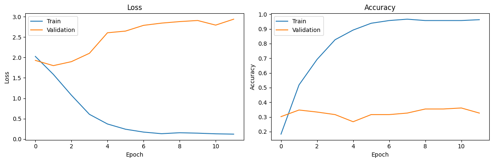
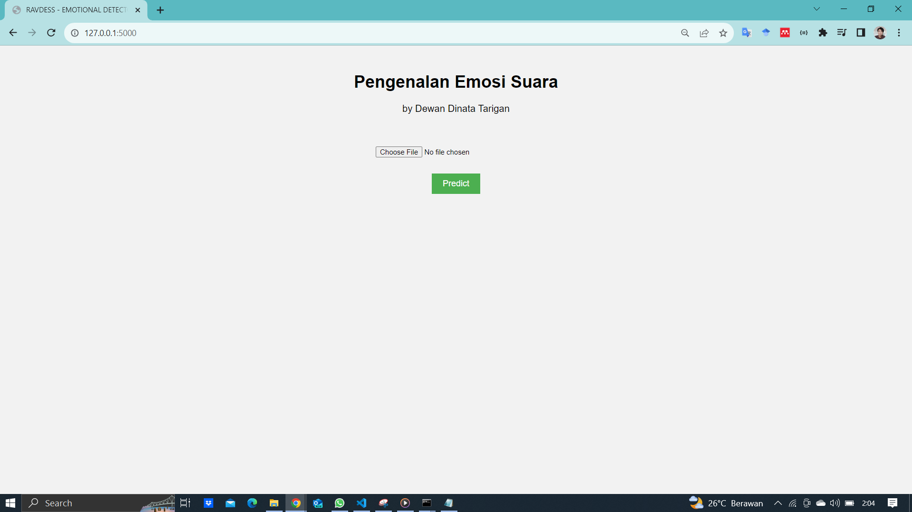
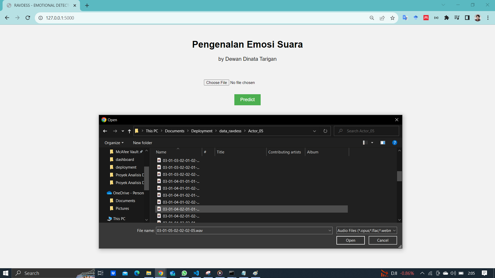
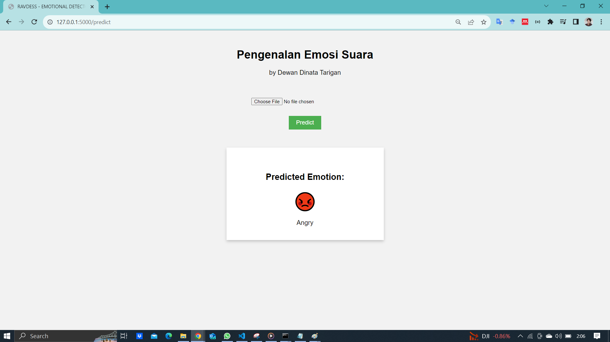

# Sistem Pengenalan Emosi
Sistem pengenalan emosi ini dilatih menggunakan algoritma BI-LSTM berdasarkan data RAVDESS (https://www.kaggle.com/datasets/uwrfkaggler/ravdess-emotional-speech-audio)
Kode ini melalui beberapa proses preprocessing untuk memproses data audio sebelum digunakan dalam model machine learning. Berikut adalah beberapa tahapan preprocessing yang digunakan dalam kode tersebut:

### Trimming Silence:
Pada tahap ini, kode menggunakan librosa.effects.trim untuk menghapus bagian-bagian audio yang sangat diam atau memiliki level kebisingan rendah. Penghapusan ini dilakukan dengan menghilangkan frame-frame audio yang memiliki kebisingan kurang dari batas tertentu (dalam hal ini, -20 dB).

### Padding:
Setelah penghapusan kebisingan, audio yang tersisa dapat memiliki panjang yang berbeda. Untuk menyamakan panjangnya, kode akan melakukan padding dengan nilai nol hingga panjang audio mencapai nilai maksimum yang telah ditentukan (max_length). Jika audio sudah mencapai atau melebihi panjang maksimum, maka akan dipotong sesuai dengan panjang maksimum tersebut.

### Normalisasi:
Selanjutnya, audio yang telah di-trim dan dipadu akan dinormalisasi menggunakan librosa.util.normalize. Normalisasi ini bertujuan untuk mengubah amplitudo audio sehingga nilainya berada dalam rentang yang lebih konsisten.
Semua tahapan preprocessing di atas bertujuan untuk menghasilkan data audio yang seragam dalam hal panjang dan amplitudo, sehingga data tersebut dapat digunakan dalam model machine learning dengan baik. Hasil dari preprocessing ini akan digunakan sebagai masukan ke dalam model untuk melakukan pengenalan emosi berdasarkan suara.

# Evaluasi Model

# ScreenShot Web Apps :

## Halaman Utama

| Halaman Input | Halaman Hasil (0) |
|----------|----------|----------|
|  |  |

**) Catatan : Program ini membutuhkan file ffmpeg agar dapat berjalan